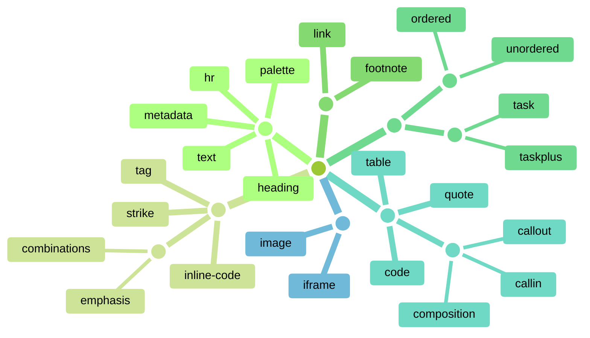

# Категории приёмов • `24`

- **Основное** → ==[[text|текст]]== — [[palette|палитры]] — [[heading|заголовки]] — [[hr|разделители]] — [[metadata|свойства заметки]]
- **В строке** → [[emphasis|выделения текста (bold, italic, …)]] — [[combinations|сочетания выделений]] — [[strike|зачёркивание]] — [[inline-code|код в строке]] — [[tag|теги]]
- **Ссылки** → [[link|ссылки]] — [[footnote|сноски]]
- **Списки** → [[ordered|нумерованные]] — [[unordered|маркированные]] — [[task|задачи]] — [[taskplus|задачи +]]
- **Блоки** → [[code|блоки кода]] — [[quote|цитаты]] — ==[[callout|выноски]]== — [[callin|Markdown внутри выносок]] — [[composition|композиции]] — [[table|таблицы]]
- **Медиа** → [[image|изображения]] — [[iframe|Iframe]]

> Заголовки, кнопки и живые примеры в категориях собираются блоком кода с меткой `hacksidian-category`

