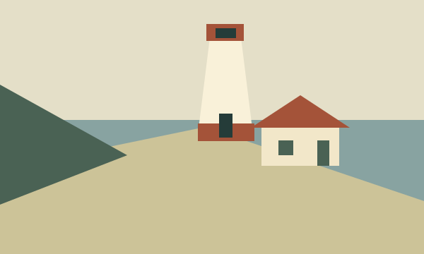

---
cssclasses:
  - atlas-callout-dossier
---

> [!dossier] Станция «Маяк»
> 
>
> ### Полевой исследовательский пункт
> | Параметр | Значение |
> | --- | --- |
> | Место | Северная бухта |
> | Основан | 1986 |
> | Команда | 4 исследователя |
>
> Наблюдаем, как меняется берег. Собираем фотографии, истории и следы прилива.
>
> > [!record] Статус
> > Экспедиция завершена · архив открыт
