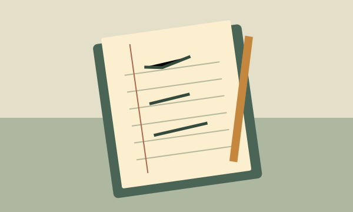

---
cssclasses:
  - atlas-callout-storyboard
---

> [!storyboard] Как повторить наблюдение
> > [!panel] 01 · Найти точку
> > 
> >
> > Ориентир — старый маяк.
>
> > [!panel] 02 · Выбрать ракурс
> > 
> >
> > Совмести горизонт с отметкой.
>
> > [!panel] 03 · Записать условия
> > 
> >
> > Время, ветер, уровень воды.
