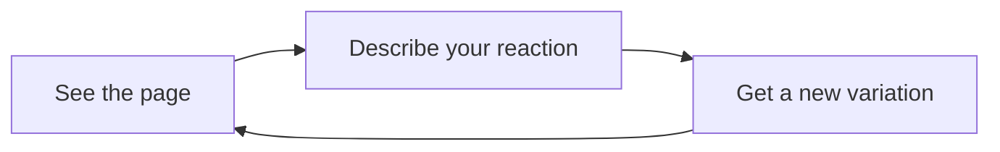

---
cssclasses:
  - callmered-coloring
  - callmered-overview
tags:
  - callmered
  - sample
  - interface/reading
aliases:
  - Markdown overview sample
---

# On reading digital text attentively

## This article shows one simple example of each basic Markdown feature visible in Obsidian Reading view.

The page is built around continuous text, its rhythm, and its hierarchy. Other elements appear within the reading flow where they support the content. Below each example is a link to a separate sample: it explores the same element in more detail, still within a long article.

### Article structure

Ordinary text consists of paragraphs. **Bold emphasis** provides an anchor, *italics* change the tone, ***bold italics*** combine both signals, ==highlighting== marks a finding, and ~~strikethrough~~ keeps an earlier version visible. The command `open -a Obsidian` shows inline code within a sentence, while \*asterisks\* can be displayed literally.

This line ends with a hard break.  
The next line remains part of the same paragraph.

#### A subsection within a section

Headings help readers scan the material without reading it in full.

##### A deeper level

Even an uncommon level should remain part of one clear system.

###### The deepest basic level

The text below it should not look arbitrarily reduced or disconnected from the article.

More detail: [[en/p002|Structure and typography]]

### Links and an image

An internal link leads to [[en/p000|another note]], while an external link leads to [Obsidian Help](https://obsidian.md/help). A #local-tag may appear nearby: it should be noticeable without drawing all the attention.


More detail: [[en/p003|Links and images]]

### Quotation

Sometimes an author briefly gives the floor to another voice.

> A good visual system does not ask to be examined separately from the content. It helps you keep reading.

After the quotation, the article returns to its usual voice without an abrupt visual jump.

More detail: [[en/p004|Quotes]]

### Lists and tasks

A short list separates observations of equal importance:

- line length;
- paragraph rhythm;
- link visibility.

A procedure reads better as a sequence:

1. open the document;
2. look at it;
3. describe your reaction.

A short task list shows the state of the work:

- [x] open the sample;
- [ ] check one questionable element;
- [ ] save a suitable variation.

More detail: [[en/p005|Lists and tasks]]

### Table

A small table helps compare several objects using the same criteria.

| Element | What we check | Role |
| :--- | :---: | ---: |
| Text | Sustained reading | Primary |
| Link | Visibility | Accent |
| Code | Difference from prose | Supporting |

More detail: [[en/p006|Tables]]

### Code

One small block shows the relationship between proportional and monospaced fonts, the background, and syntax highlighting.

```css
.markdown-reading-view p {
  max-width: 68ch;
  line-height: 1.65;
}
```

After the code, the eye should return to the next paragraph without effort.

More detail: [[en/p007|Code in long text]]

### Diagram

A simple flowchart tests lines, nodes, labels, and the width occupied by the diagram.



The diagram remains an illustration of an idea, rather than a separate application inside the note.

More detail: [[en/p008|Mermaid diagrams]]

### Callout

A callout helps when a short passage deserves a different level of attention.

> [!NOTE] Reference example
> The user's reaction concerns the entire visible page, not just a single CSS property.

The next paragraph resumes the article and lets you assess the spacing after the callout.

More detail: [[en/p009|Callouts in a long article]]

### Formula and footnote

The inline formula $L = 0.2126R + 0.7152G + 0.0722B$ behaves like part of a sentence, while a display formula occupies its own line:

$$
C = \frac{L_{\text{light}} + 0.05}{L_{\text{dark}} + 0.05}
$$

A footnote[^context] adds secondary text without interrupting the main argument.

[^context]: This is the only basic footnote in the overview article.

More detail: [[en/p010|Formulas and footnotes]]

---

The final rule marks the end of the material. The starting sample remains a map of the system: when an element needs closer attention, the next link opens its detailed context without turning this article into a reference manual.
