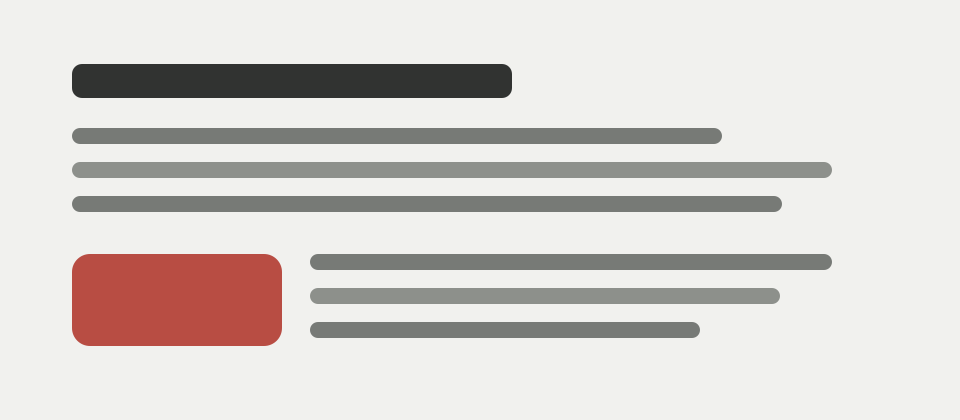

---
cssclasses:
  - callmered-coloring
  - callmered-links
tags:
  - callmered
  - sample
  - interface/links
---

# Links and images in a long article

## This sample tests navigation signals and images in the reading flow, from a subtle link to a large illustration between paragraphs.

### Links within an ordinary line

The internal link to [[en/p000|Welcome]] leads to an existing note, while [[Missing note]] shows a target that has not been created. An [external link to Obsidian](https://obsidian.md) appears nearby, so both types can be compared in one sentence.

The label need not match the title: [[en/p000|starting page]]. In Markdown, the same idea appears as a [file link](p000.md), while the link to [[#Links within an ordinary line|this article's heading]] remains local.

An ordinary paragraph after several links helps check whether underlines, icons, and accent colours leave too much visual noise in the line.

### A link within expressive text

A dense sentence contains a [**bold external link**](https://obsidian.md/help), *italics beside an [[en/p000|internal link]]*, and `code` before [the documentation](https://obsidian.md/help/syntax). Different styles should not shift the baseline.

Tags provide another navigation signal: #reading, #visual-style, and the nested #callmered/samples. Quiet text without links follows them.

### An illustration between paragraphs

A full paragraph precedes the image. It establishes the width of the text column and helps assess the space above the illustration.

The text continues after the image. This tests the lower spacing, a caption derived from the alt text, and the illustration's connection to the article.

### One illustration at different sizes

A small wikilink embed behaves almost like an inset within the note:

![[en/assets/pole-chteniya.svg|180]]

The medium version becomes a separate module:

![[en/assets/pole-chteniya.svg|360]]

The full-width Markdown version again tests the container's natural width:

### A link to a precise passage

This paragraph has an identifier so it can be referenced from elsewhere. ^exact-passage

Below is a link back to the [[#^exact-passage|precise passage]]. It should be recognisable without appearing more important than the paragraph itself.

The closing text brings the page back together after images and navigation signals. A good link system helps readers move through the material without turning every line into a control panel.
