---
cssclasses:
  - callmered-coloring
  - callmered-mermaid
tags:
  - callmered
  - sample
  - interface/diagrams
aliases:
  - Mermaid in long text
---

# Diagrams within a long text

## A diagram should support reading without turning the page into a gallery of widgets: here, different diagrams repeatedly return to ordinary prose.

### From a reaction to a new version

Start by examining the overall workflow. A flowchart shows branches, several arrow types, and nodes of different shapes.

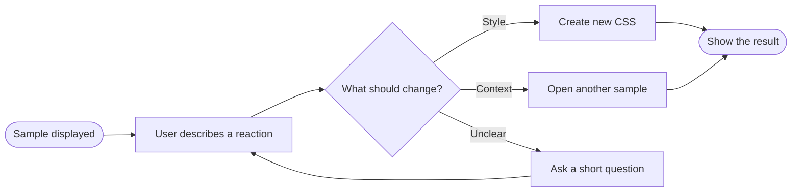

Labels on lines and distinguishable nodes matter especially here because the reader constantly shifts attention between the text and the direction of movement.

### States of one iteration

A flowchart explains the route, while a state diagram shows the system's valid states. This example includes initial and final states, branching, and a return.

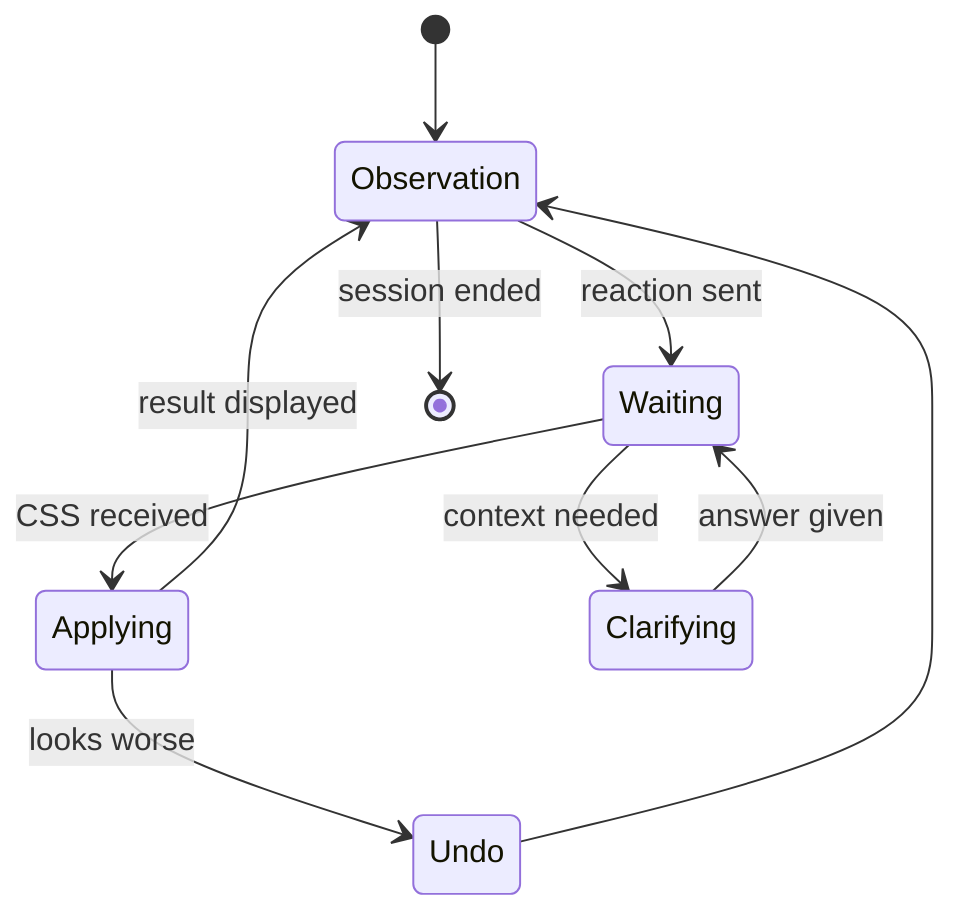

State diagrams have many short labels. They expose undersized text, weak arrows, and poor contrast in supporting elements.

### A map of impressions

A mindmap works differently: there is no single route, but hierarchy and branch density are clearly visible.

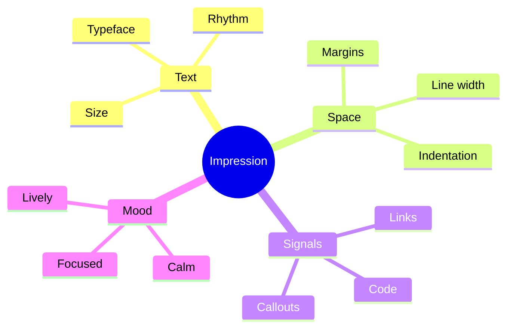

This map reveals how neatly the theme handles several levels of labels and numerous curves.

### The flow of attention

Sankey diagrams show the distribution of an illustrative flow rather than a sequence of actions. Ribbon width becomes a visual parameter of its own.

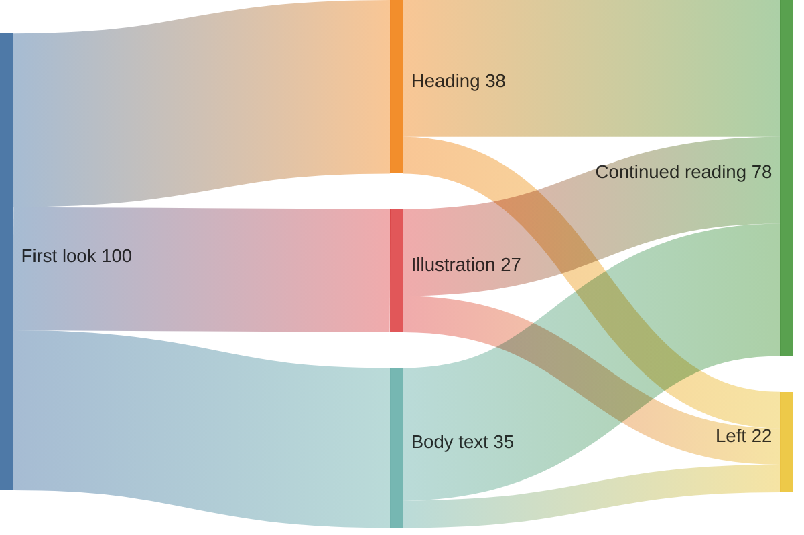

This diagram is especially sensitive to neighbouring flow colours and the readability of labels near its edges.

### Planning a short cycle

A Gantt chart combines text, bars, a grid, and a time axis. It tests elements absent from ordinary diagrams.

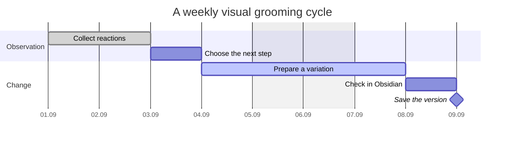

Gantt charts usually take up substantial horizontal space within an article. Here you can decide whether the chart needs its own area or a visual connection to ordinary text.

### A conversation between components

A sequence diagram tests vertical lines, message labels, and repeated columns.

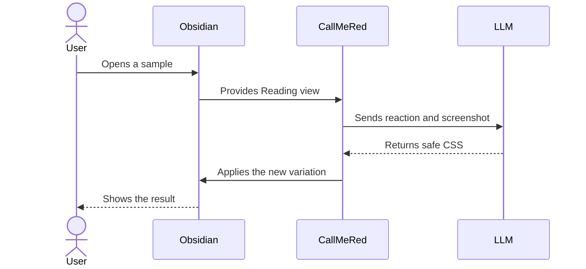

Repeated elements quickly reveal whether strokes, arrows, or message backgrounds clash with the rest of the page.

### A history of decisions

A timeline turns a sequence of events into a compact horizontal story with groups of entries.

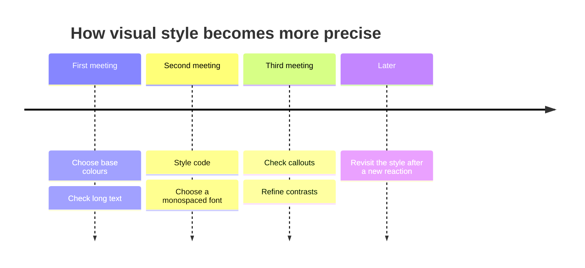

A timeline makes long labels and the distribution of free space particularly visible.

### Changing scores

An XY chart adds coordinate axes, numeric ticks, bars, and a line. It approaches a conventional chart while using the same Mermaid environment.

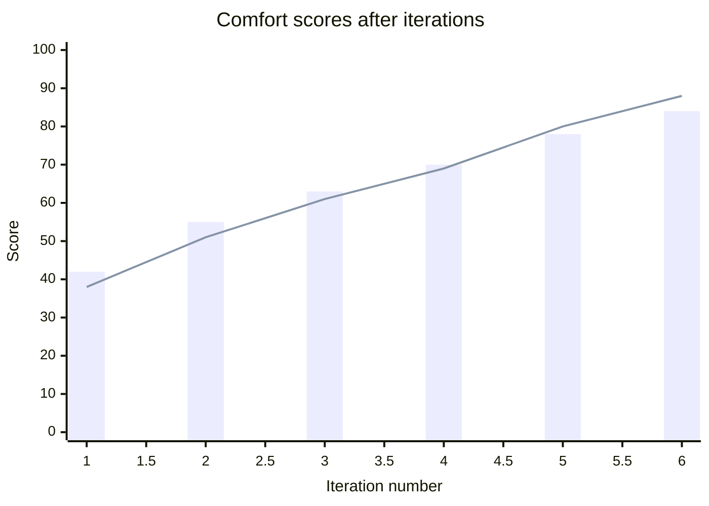

### The user journey

A user journey combines stages, participants, and emotional scores from one to five.

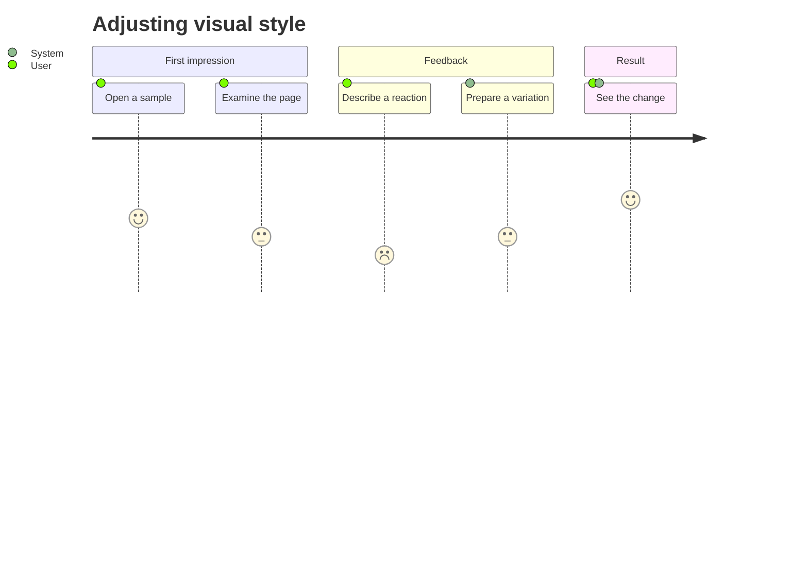

This reveals how the theme distinguishes sections, scores, and repeated tracks.

### A map of decisions

A quadrant chart positions options along two independent axes.

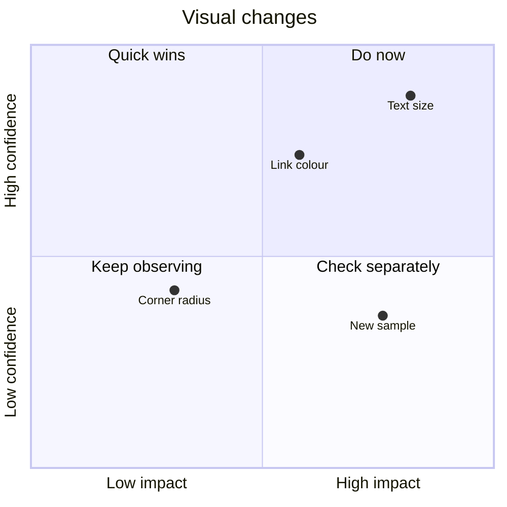

It introduces four background regions, axes, and freely positioned point labels.

### Branching versions

GitGraph is useful beyond programming: it clearly shows parallel variations and the moment of choice.

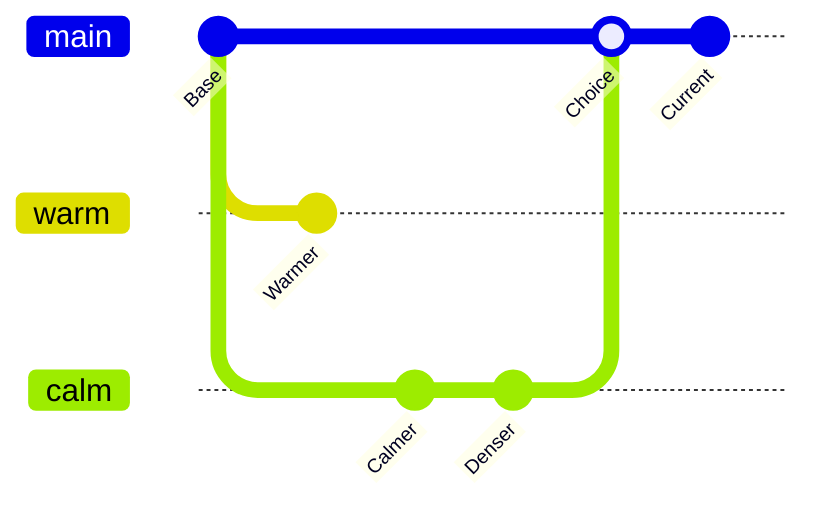

Coloured branches, circular markers, and short labels provide another kind of visual rhythm.

### The next iteration board

Kanban distributes cards across columns, testing a composition that is almost an interface.

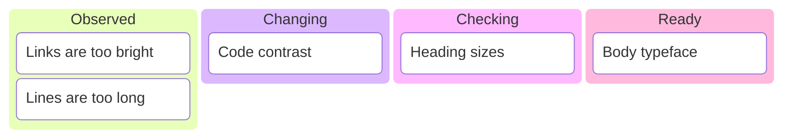

Internal padding, borders, and the difference between column and task backgrounds matter for these cards.

### A profile of several qualities

A radar chart compares two variations across several axes at once.

This is the first radial chart in the set: its grid and translucent regions behave differently from rectangular diagrams.

### A hierarchy of space

A treemap turns a nested structure into rectangles of different sizes.

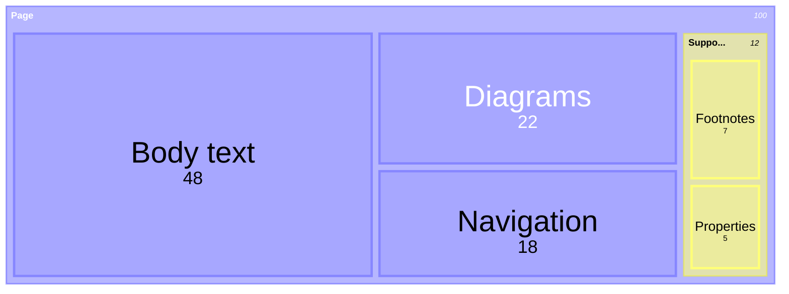

It helps assess a dense mosaic of fills, borders, and labels.

### Overlapping requirements

A Venn diagram shows sets and their intersections.

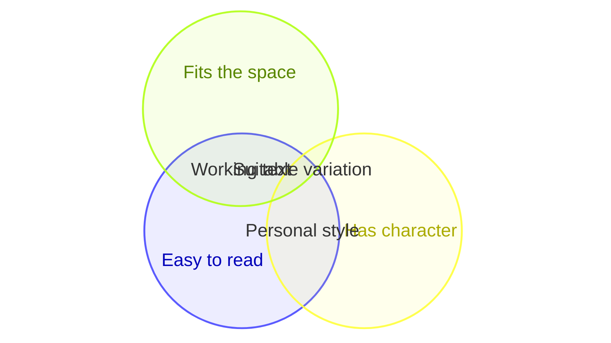

Overlapping translucent regions make the palette's behaviour particularly visible.

### Causes of visual discomfort

An Ishikawa diagram gathers possible causes around a single problem.

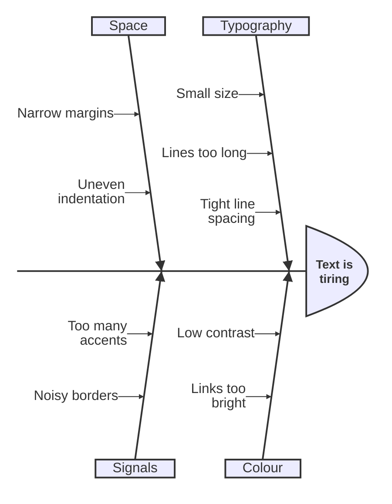

The fishbone combines a long central axis with numerous sloping branches.

The final paragraph returns the page to ordinary reading. After several dense diagrams, check whether plain text starts to look too weak or, conversely, too heavy.
