---
cssclasses:
  - hacksidian-coloring
  - hacksidian-mermaid
tags:
  - hacksidian
  - раскраска
  - интерфейс/диаграммы
aliases:
  - Mermaid в длинном тексте
---

# Диаграммы внутри длинного текста

## Диаграмма в статье должна помогать чтению, а не превращать страницу в галерею виджетов: здесь разные схемы постоянно возвращаются к обычной прозе.

### Путь от реакции к новой версии

Сначала полезно увидеть общий ход работы. Блок-схема показывает развилки, несколько видов стрелок и узлы разной формы.

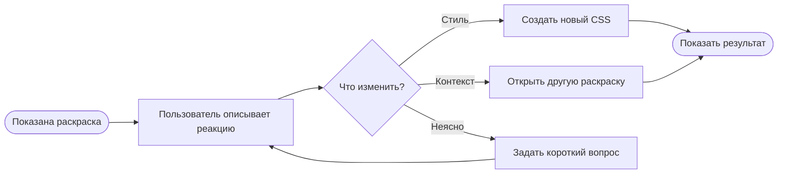

В такой схеме особенно важны подписи на линиях и различимость узлов, потому что читатель постоянно переводит взгляд между текстом и направлением движения.

### Состояния одной итерации

Блок-схема объясняет маршрут, а диаграмма состояний — допустимые состояния системы. Здесь есть начальное и конечное состояния, ветвление и возврат.

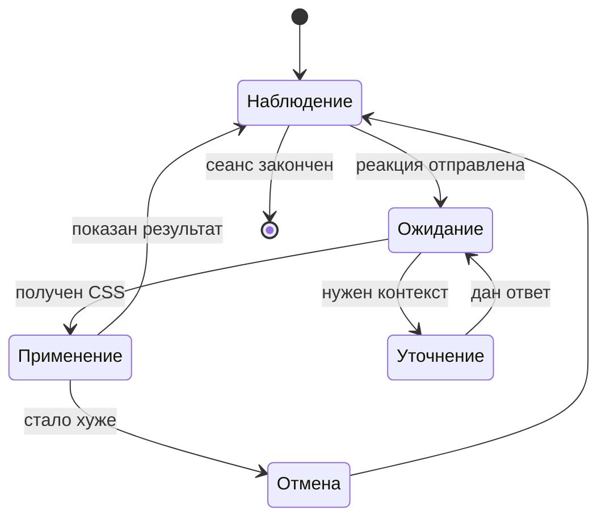

У диаграммы состояний много коротких подписей. Она хорошо обнаруживает слишком мелкий текст, слабые стрелки и неудачный контраст служебных элементов.

### Карта впечатления

Mindmap работает иначе: здесь нет единственного маршрута, зато хорошо видна иерархия и плотность ветвей.

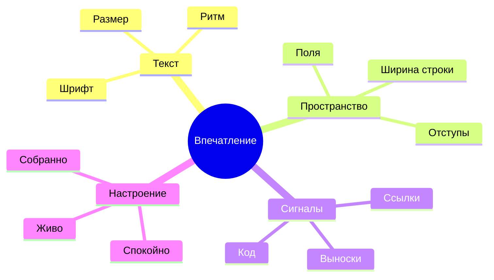

На такой карте хорошо заметно, насколько аккуратно тема справляется с несколькими уровнями подписей и большим количеством изгибов.

### Поток внимания

Sankey показывает не порядок действий, а распределение условного потока. Ширина лент становится самостоятельным визуальным параметром.

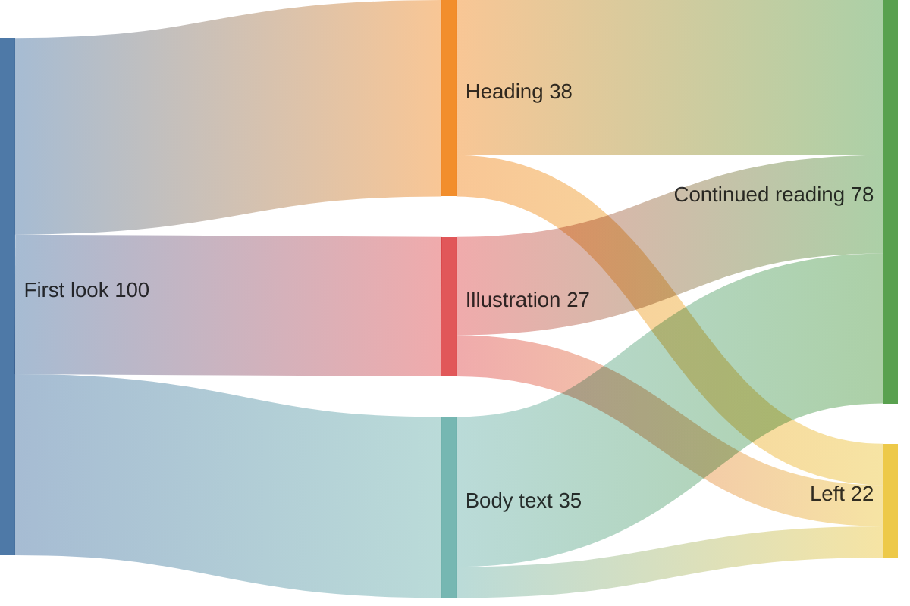

Эта схема особенно чувствительна к цветам соседних потоков и читаемости подписей, расположенных у краёв.

### План короткого цикла

Диаграмма Гантта сочетает текст, полосы, сетку и временную ось. Она полезна для проверки элементов, которых нет в обычных схемах.

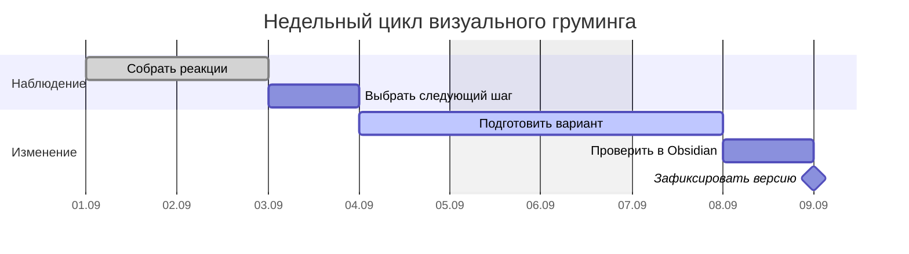

Внутри статьи Гантт обычно занимает много места по горизонтали. Здесь можно решить, хочется ли ему отдельного поля или визуальной связи с обычным текстом.

### Разговор компонентов

Диаграмма последовательности проверяет вертикальные линии, подписи сообщений и повторяющиеся колонки.

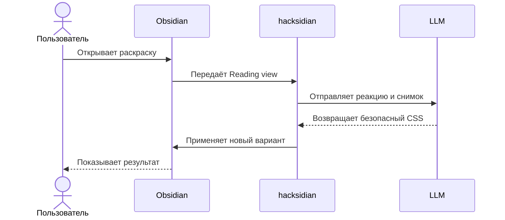

Повторяемость элементов позволяет быстро заметить, если штрихи, стрелки или фон сообщений спорят с остальной страницей.

### История решений

Timeline превращает последовательность событий в компактную горизонтальную историю с группами записей.

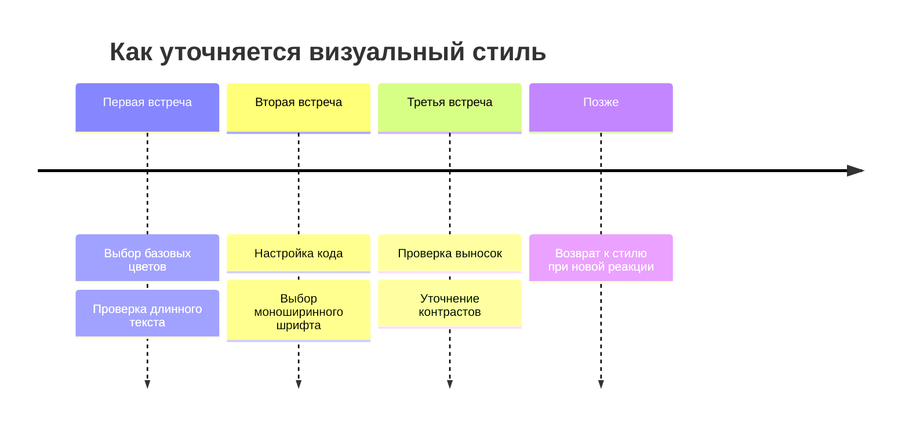

На временной шкале особенно хорошо видны длинные подписи и распределение свободного пространства.

### Изменение оценки

XY chart добавляет координатные оси, числовые отметки, столбцы и линию. Это уже почти классический график, но он использует ту же Mermaid-среду.

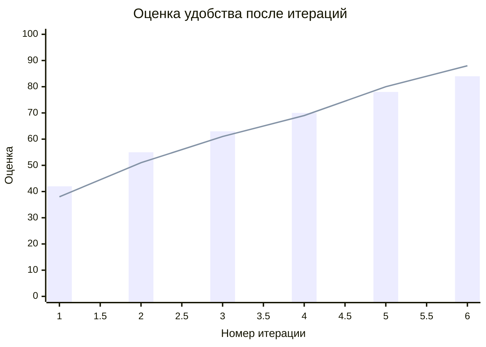

### Путь пользователя

User journey соединяет этапы, участников и эмоциональную оценку от одного до пяти.

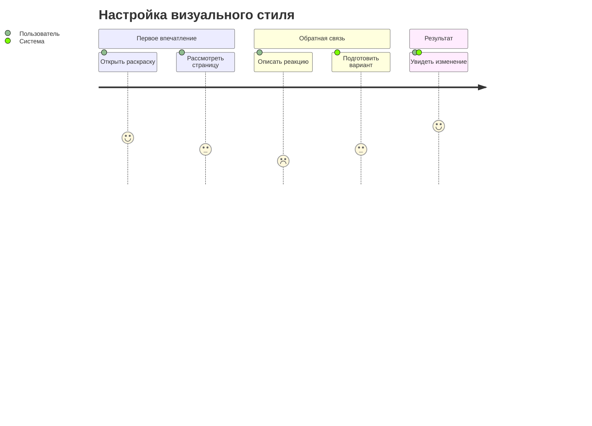

Здесь особенно заметно, как тема различает секции, оценки и повторяющиеся дорожки.

### Карта решений

Квадрантная диаграмма размещает варианты по двум независимым осям.

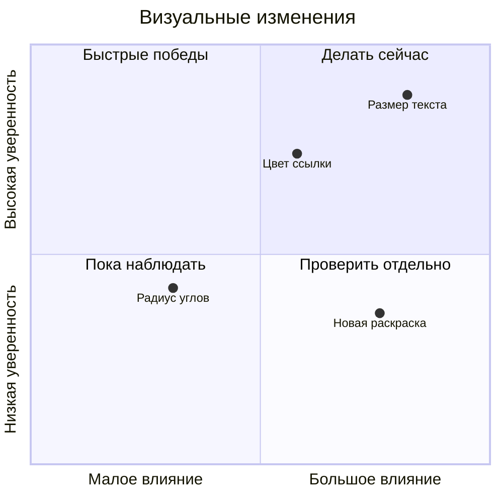

У неё появляются четыре фоновых поля, оси и свободно расположенные подписи точек.

### Ветвление версий

GitGraph полезен не только программистам: он наглядно показывает параллельные варианты и момент выбора.

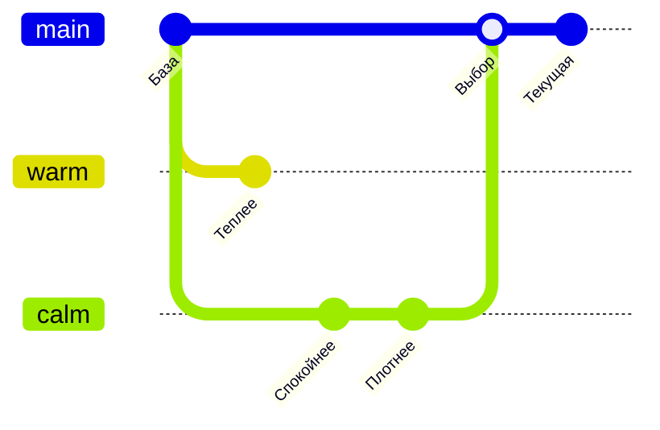

Цветные ветки, круглые отметки и короткие подписи дают ещё один тип визуального ритма.

### Доска следующей итерации

Kanban раскладывает карточки по колонкам и проверяет уже почти интерфейсную композицию.

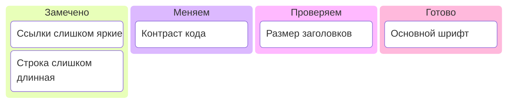

У карточек важны внутренние поля, границы и разница между фоном колонки и фоном задачи.

### Профиль нескольких качеств

Radar chart сравнивает два варианта сразу по нескольким осям.

Это первый радиальный график в наборе: сетка и полупрозрачные области ведут себя иначе, чем прямоугольные схемы.

### Иерархия пространства

Treemap превращает вложенную структуру в прямоугольники разного размера.

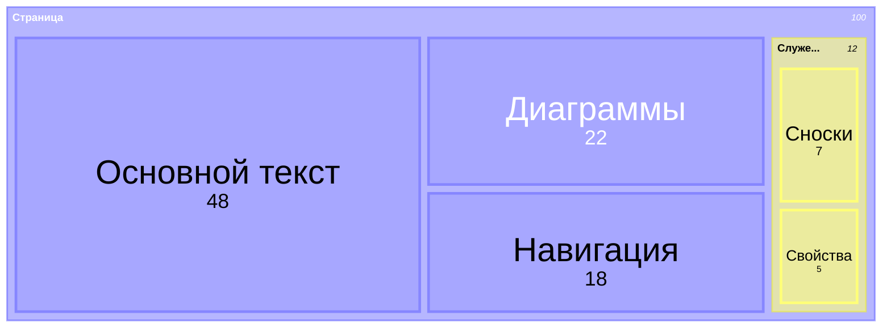

Она помогает оценить плотную мозаику заливок, границ и подписей.

### Пересечение требований

Venn показывает множества и зоны их пересечения.

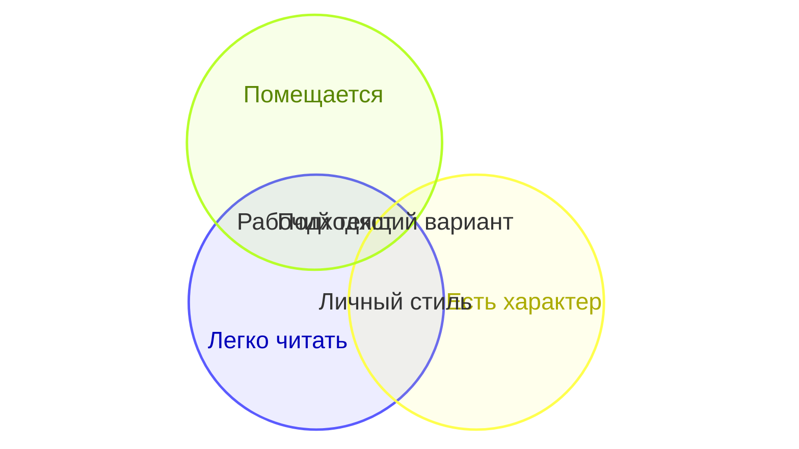

Перекрывающиеся полупрозрачные области особенно хорошо проявляют поведение палитры.

### Причины визуального дискомфорта

Диаграмма Исикавы собирает возможные причины вокруг одной проблемы.

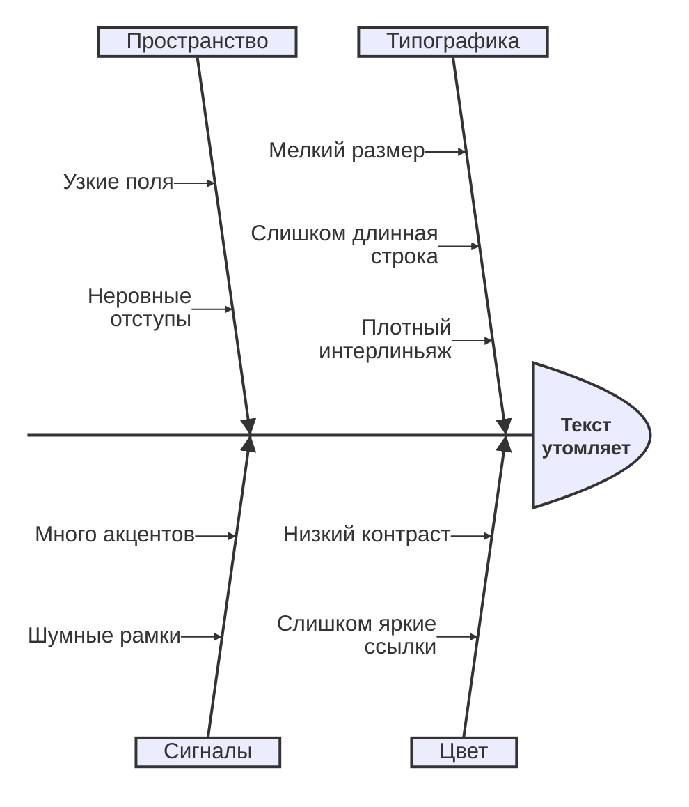

«Рыбья кость» сочетает длинную центральную ось с большим количеством наклонных ветвей.

Последний абзац возвращает страницу к обычному чтению. После нескольких насыщенных схем важно проверить, не начинает ли простой текст казаться слишком слабым или, наоборот, слишком тяжёлым.
