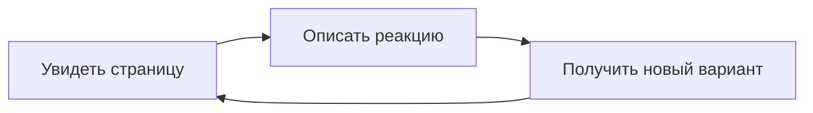

---
cssclasses:
  - callmered-coloring
  - callmered-overview
tags:
  - callmered
  - раскраска
  - интерфейс/чтение
aliases:
  - Обзорная раскраска Markdown
---

# О внимательном чтении цифрового текста

## Эта статья показывает по одному спокойному примеру каждой базовой возможности Markdown, которая заметна в Obsidian Reading view.

Основа страницы — связный текст, его ритм и иерархия. Остальные элементы появляются внутри чтения только там, где помогают содержанию. Под каждым примером есть ссылка на отдельную раскраску: там тот же элемент рассматривается подробнее, но по-прежнему внутри длинной статьи.

### Структура статьи

Обычный текст складывается из абзацев. **Жирное выделение** создаёт опору, *курсив* меняет интонацию, ***жирный курсив*** соединяет оба сигнала, ==подсветка== отмечает найденное, а ~~зачёркивание~~ оставляет видимым прежний вариант. Команда `open -a Obsidian` показывает инлайн-код прямо в строке, а \*звёздочки\* можно вывести буквально.

Эта строка заканчивается жёстким переносом.  
Следующая остаётся частью того же абзаца.

#### Подраздел внутри раздела

Заголовки помогают быстро просмотреть материал, не читая его целиком.

##### Более глубокий уровень

Редкий уровень всё ещё должен оставаться частью одной понятной системы.

###### Самый глубокий базовый уровень

После него текст не должен выглядеть случайно уменьшенным или оторванным от статьи.

Подробнее: [[Структура и типографика длинной статьи]]

### Ссылки и изображение

Внутренняя ссылка ведёт к [[Welcome|другой заметке]], а внешняя — к [справке Obsidian](https://obsidian.md/help). Рядом может встретиться #локальный-тег, который должен быть заметен, но не обязан перетягивать всё внимание.


Подробнее: [[Ссылки и изображения в длинной статье]]

### Цитата

Иногда автору важно ненадолго передать голос другому человеку.

> Хорошая система оформления не просит рассматривать её отдельно от содержания. Она помогает продолжать чтение.

После цитаты статья возвращается к обычному голосу без резкого визуального скачка.

Подробнее: [[Цитаты в длинной статье]]

### Списки и задачи

Небольшое перечисление помогает отделить равноправные наблюдения:

- длина строки;
- ритм абзацев;
- заметность ссылок.

Порядок действий лучше читается как последовательность:

1. открыть документ;
2. рассмотреть его;
3. описать реакцию.

А короткий список задач показывает состояние работы:

- [x] открыть раскраску;
- [ ] проверить один спорный элемент;
- [ ] сохранить подходящий вариант.

Подробнее: [[Списки и задачи в длинной статье]]

### Таблица

Когда несколько объектов сравниваются по одним и тем же признакам, появляется небольшая таблица.

| Элемент | Что проверяем | Состояние |
| :--- | :---: | ---: |
| Текст | Длинное чтение | Основное |
| Ссылка | Заметность | Акцент |
| Код | Отличие от прозы | Служебное |

Подробнее: [[Таблицы в длинной статье]]

### Код

Один небольшой блок показывает отношения обычного и моноширинного шрифтов, фона и подсветки синтаксиса.

```css
.markdown-reading-view p {
  max-width: 68ch;
  line-height: 1.65;
}
```

После кода взгляд должен без усилия вернуться к следующему абзацу.

Подробнее: [[Код в длинном тексте]]

### Диаграмма

Простая блок-схема проверяет линии, узлы, подписи и занимаемую схемой ширину.



Диаграмма остаётся иллюстрацией мысли, а не отдельным приложением внутри заметки.

Подробнее: [[Диаграммы Mermaid в тексте]]

### Выноска

Выноска нужна, когда небольшой фрагмент заслуживает другого уровня внимания.

> [!NOTE] Контрольный пример
> Реакция пользователя относится к увиденной странице целиком, а не только к одному CSS-свойству.

Следующий абзац снова продолжает статью и позволяет оценить расстояние после выноски.

Подробнее: [[Выноски|Выноски в длинной статье]]

### Формула и сноска

Инлайн-формула $L = 0.2126R + 0.7152G + 0.0722B$ ведёт себя как часть предложения, а отдельная формула занимает собственную строку:

$$
C = \frac{L_{\text{светлый}} + 0.05}{L_{\text{тёмный}} + 0.05}
$$

Сноска[^context] добавляет вторичный текст, не ломая основной ход мысли.

[^context]: Это единственная базовая сноска в обзорной статье.

Подробнее: [[Формулы и сноски в длинной статье]]

---

Последняя линия отделяет завершение материала. Стартовая раскраска остаётся картой системы: если какой-то элемент требует отдельного внимания, следующая ссылка открывает его подробный контекст, а не превращает эту статью в справочник.
